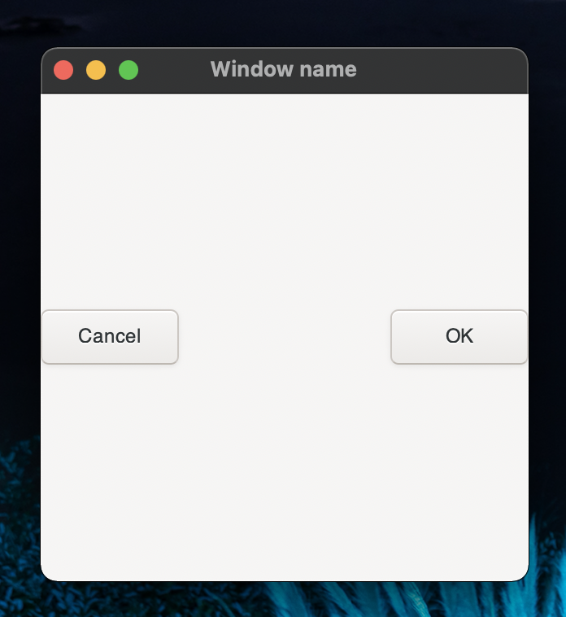

# 三角関数を視覚的に理解したい...
というお客様の声にお応えしました．GUIを主体とした実装を目指します．まずは，三角関数をウインドウに表示することを目標に始めてみましょう．

# Gtk.jl 
<!-- リンクをラベル付けしながら列挙しておくことができる -->
[Gtk_home]:https://juliagraphics.github.io/Gtk.jl/latest/

<!-- ========================================== -->
GUI（グラフィカルユーザーインターフェース）を作成する Julia パッケージはいくつも存在します．その中でも今回は，Gtk.jl を試してみたいと思います．

まずは，パッケージを追加します．ターミナルからパッケージモードに入り "add Gtk" と入力します．
```julia
(julia) pkg> add Gtk
```
あとはGtk.jl の[公式ドキュメントページ][Gtk_home]を参考にしていきます．

# ウインドウを表示
Gtkの動作はかなり直感的です．試しにウインドウを表示してみます．
```julia
win = GtkWindow("Window name", 300, 300) 
```
このコードを実行してみると以下のようなウインドウがポップアップされると思います．


<!--- 
「クリップボードにコピー」をする必要がある．
macでは，command+shift+4 でスクショ後，controlを押しながらキーを離す．
これで，クリップボードに保存できる．
貼り付けの際は，command+option+vで貼り付け． 
デフォルトの Paste Image: Insert Pattern -> ${imageSyntaxPrefix}${imageFilePath}${imageSyntaxSuffix}
--->

このウインドウにいろいろな物を配置していく，というのが基本的な方針になります．

# ボタンを配置
表示したウインドウにボタンを設置してみます．次のコードを実行してみます．
```julia
win    = GtkWindow("Window name", 300, 300) #windowの表示
hbox   = GtkButtonBox(:h)
ok     = GtkButton("OK")
cancel = GtkButton("Cancel")
push!(win, hbox)
push!(hbox, cancel)
push!(hbox, ok)
showall(win)
```
次のようなウインドウが出力されます．



ボタンが付きました．表示されたボタンはクリックすることはできますが，何も起こりません．何らかのアクションを返すようにするには，もう少しコードを書き足す必要があります．

そのまえに，ここでのコードの説明をしておきます．
```julia
hbox = GtkButtonBox(:h)
```
でボタンを入れる箱を作ります．`:h` で箱の方向（水平方向）を指定しています．`:v` （垂直方向）も使用できます．

```julia
ok = GtkButton("OK")
```
でボタンを作ります．ダブルクォーテーションでボタンに表示される文字を変えられます．

表示したいボタンを用意したら，`win` に `push` していきます．まずは，箱を `push` します．
```julia
push!(win, hbox)
```
ウィンドウに箱を用意したら，箱の中にボタンを入れていきましょう．
```julia
push!(hbox, cancel)
push!(hbox, ok)
```
これで出来上がりです．最後に `showall(win)` で作ったウインドウを表示しました．

# ボタンを押せるようにする
ボタンを押すためには，ボタンと関数を結びつけ，ボタンを押されたことで特定の返り値を返す関数を作り，返り値を取得する必要があります．
