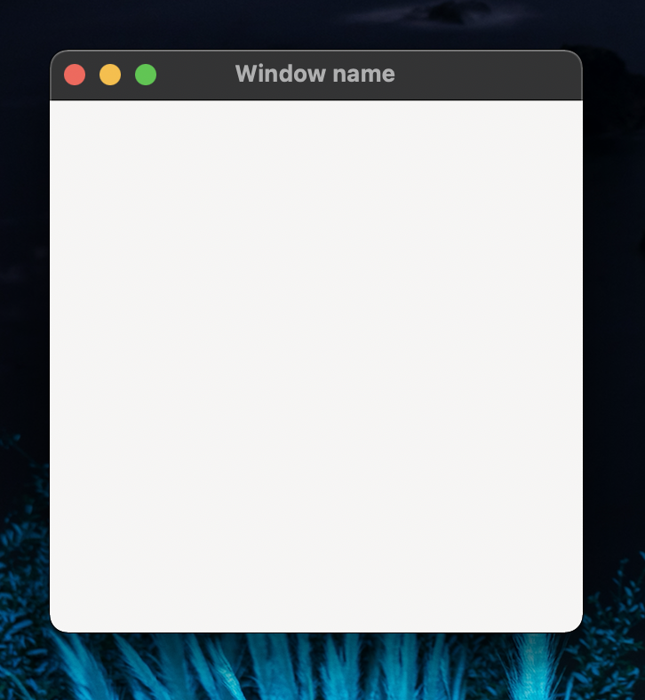

# 三角関数を視覚的に理解したい...
というお客様の声にお応えしました．GUIを主体とした実装を目指します．まずは，三角関数をウインドウに表示することを目標に始めてみましょう．

# Gtk.jl 
<!-- リンクをラベル付けしながら列挙しておくことができる -->
[Gtk_home]:https://juliagraphics.github.io/Gtk.jl/latest/

<!-- ========================================== -->
GUI（グラフィカルユーザーインターフェース）を作成する Julia パッケージはいくつも存在します．その中でも今回は，Gtk.jl を試してみたいと思います．

まずは，パッケージを追加します．ターミナルからパッケージモードに入り "add Gtk" と入力します．
```julia
(julia) pkg> add Gtk
```
あとは，Gtk.jl の[公式ドキュメントページ][Gtk_home]を参考にしていきます．

#  ウインドウの表示
Gtkの動作はかなり直感的です．試しにウインドウを表示してみます．
```julia
win = GtkWindow("Window name", 300, 300) 
```
このコードを実行してみると以下のようなウインドウがポップアップされると思います．


<!--- 
「クリップボードにコピー」をする必要がある．
macでは，command+shift+4 でスクショ後，controlを押しながらキーを離す．
これで，クリップボードに保存できる．
貼り付けの際は，command+option+vで貼り付け． 
デフォルトの Paste Image: Insert Pattern -> ${imageSyntaxPrefix}${imageFilePath}${imageSyntaxSuffix}
--->